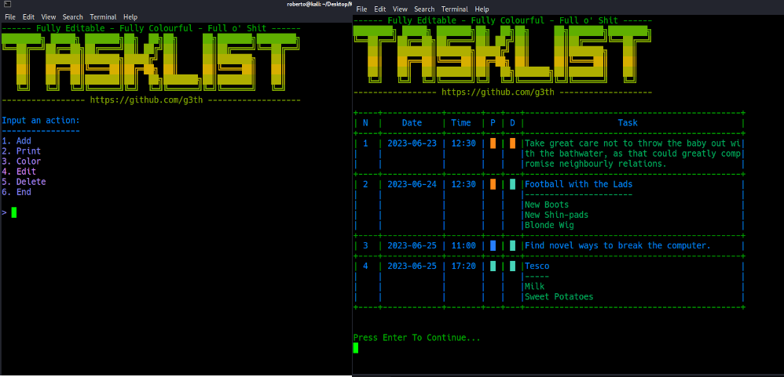

# Kotlin Tasklist for Terminals
## Implementing a daily task list TUI



A project which implements a task-list for terminals, with simple TUI menu which allows the user to choose different options. The menu now includes a proper print layout, composed of a table which includes time, date, task, and colour-coded priority and due tags.

Also includes the ability to change colour layout for the user.

The task section of the table only has space for 44 characters at most, and the layout class is able to adequately split larger inputs into various chunks, and subsequently organize them into the appropriate format.

Allows the user to:

1) Add Tasks by number (i.e. 1 - Dentist)
2) Add current date and time for tasks (i.e. 1 2023-11-11 11:33)
3) Add a task priority (i.e. 1 2023-11-11 11:33 C (for Critical))
4) Edit every aspect of the created task, from date to rewriting the task itself.

The program will also attach a 'due-date-tag' to the top of the task, next to date/time, to indicate whether the task is overdue or ontime.

Finally, save the task-list in Json format using the Moshi library, and re-load the list everytime the program starts.

------------------------------------------------------------------

How to compile/run in terminal:

Requires Kotlin command-line compiler, get the latest version:

```https://github.com/JetBrains/kotlin/releases/tag/v1.8.22```


Compile with:

```kotlinc tasklist.kt printout.kt saveToJson.kt -include-runtime -d tasklist.jar -cp libs/kotlinx-datetime-jvm-0.3.1.jar:libs/kotlinx-datetime-jvm-0.3.1.jar:libs/moshi-1.15.0.jar:libs/moshi-kotlin-1.15.0.jar:libs/okio-2.10.0-sources.jar:libs/okio-2.10.0-sources.jar:libs/okio-jvm-2.10.0.jar```

Run with:

```java -cp tasklist.jar:libs/kotlinx-datetime-jvm-0.3.1.jar:libs/kotlinx-datetime-jvm-0.3.1.jar:libs/moshi-1.15.0.jar:libs/moshi-kotlin-1.15.0.jar:libs/okio-2.10.0-sources.jar:libs/okio-2.10.0-sources.jar:libs/okio-jvm-2.10.0.jar tasklist.TasklistKt```

TODO:

Fix table colours. There are printout errors and layout isn't consistent.

If user sets new colour, the existing tasks colour only changes on restart.
